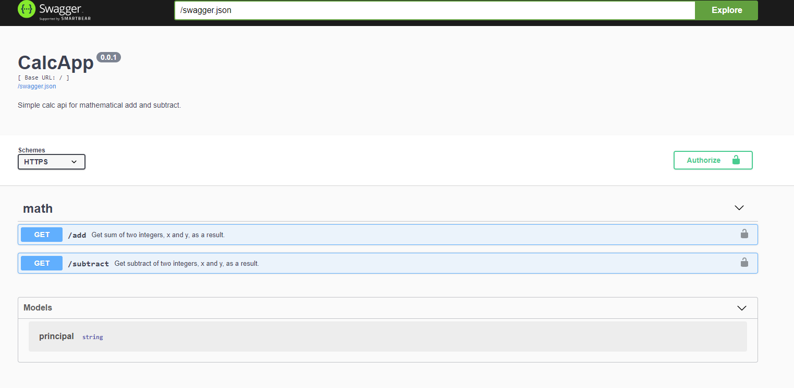

# Swagger based Calc App

## Summary
- Uses https
- Has api documentation using openapi/swagger


## Run server
Binary, main, file of the server is also pushed to repo for ease of use.

```
./run_server.sh
```

## Using Curl
```
curl -k -H 'X-API-Key:abcd' 'https://127.0.0.1:4433/add?a=1&b=211'
curl -k -i -H 'Content-Type: application/keyauth.api.v1+json' -H 'X-API-Key:abcd' 'https://127.0.0.1:4433/add?a=1&b=211'

curl -k -H 'X-API-Key:abcd' 'https://127.0.0.1:4433/subtract?a=1&b=11'
curl -k -i -H 'Content-Type: application/keyauth.api.v1+json' -H 'X-API-Key:abcd' 'https://127.0.0.1:4433/subtract?a=1&b=11'
```

## Generate Client and Server from swagger spec
```
swagger  generate server -A github.com/eranik/calc-app -P models.Principal -f ./swagger.yaml
swagger  generate client -A github.com/eranik/calc-app -P models.Principal -f ./swagger.yaml
```
I have done this already

## Generate certs

```
ssh-keygen -t rsa -b 4096 -C "your_email@example.com" -m PEM -f k -P "" > k.pem
openssl req -new -x509 -key ./k -out cacert.pem -days 1095
```

I have done this already

## Documentation
Notes:
1. Don't forget 'X-API-Key:abcd' header for authentication.
2. Use ModHeader extension for Chrome
3. When accessing below url, accept certificate errors, since it is not part of valid CA chain and is self-signed.

```
https://127.0.0.1:4433/docs
```




### vscode plugin for swagger.yaml
OpenAPI (Swagger) Editor
or use online at https://editor.swagger.io/


## Further notes
### Go Module
```
go mod init 'github.com/eranik/calc-app'
go get -u ./...
```

### Build
```
go build ./cmd/github-com-eranik-calc-app-server/main.go 
```

### Run
```
./run_server.sh
```
